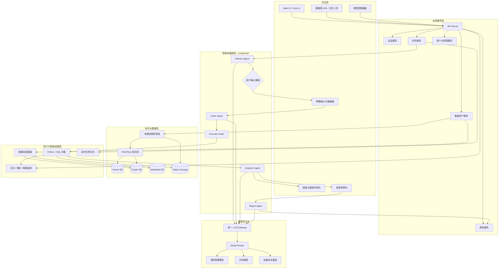
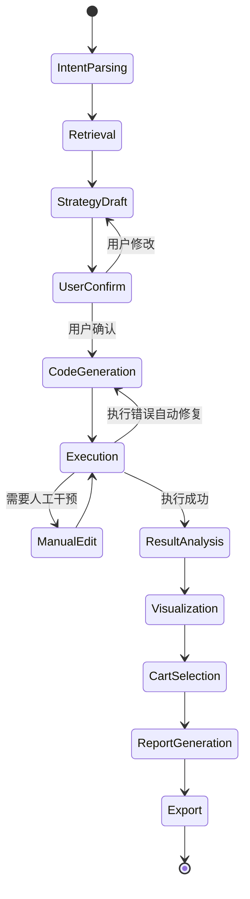
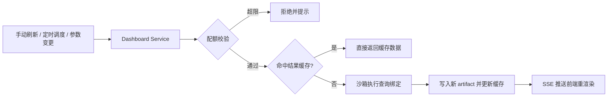
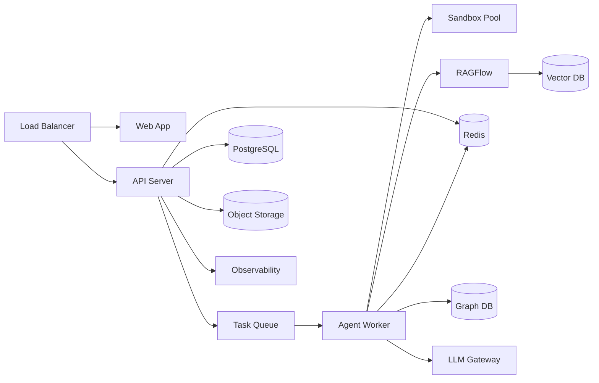

# Data-RAG-Agent 工程系统架构方案

## 1. 文档目标

本文基于当前项目说明 `dragent.md`，给出 Data-RAG-Agent 的工程系统架构方案，重点覆盖总体架构、功能模块设计、核心数据流、技术选型建议、部署形态与演进路径。

系统目标是将传统静态 BI 升级为基于自然语言的商业数据智能诊断平台，通过 RAG、知识图谱与多智能体编排，实现“数据接入 - 策略规划 - 用户确认 - 代码执行 - 结果解释 - 报告生成”的可追溯闭环。

## 2. 建设原则

1. 可追溯：分析策略、生成代码、执行结果、数据引用、报告结论均需要记录来源与版本。
2. 白盒化：分析过程不只输出答案，还要暴露策略、代码、图表配置和证据链。
3. 人机协同：关键分析策略必须经用户确认后再执行，允许用户修改策略或代码。
4. 模型可切换：不同 Agent 可按任务类型动态选择 LLM，兼顾成本、速度与质量。
5. 模块解耦：数据接入、知识检索、智能体编排、代码执行、报告导出相互独立，便于扩展和替换。
6. 安全隔离：数据库访问、文件解析、代码执行、凭证管理均需边界清晰。

## 3. 总体架构

### 3.1 架构分层

系统建议采用六层架构：

| 层级 | 职责 | 关键组件 |
| --- | --- | --- |
| 交互层 | 对话、文件上传、策略确认、图表展示、报告购物车 | Web UI、Chat UI、Chart Renderer、Strategy Editor |
| 应用服务层 | 会话管理、任务管理、资产管理、导出管理 | API Server、Session Service、Task Service、Report Service |
| 智能体编排层 | 意图识别、策略生成、代码生成、执行调度、结果解释 | LangGraph、Planner Agent、Coder Agent、Analyzer Agent、Report Agent |
| 模型网关层 | 统一模型调用、路由、限流、审计、成本统计 | OpenAI-compatible Gateway、Model Router |
| 知识与数据层 | 文档解析、RAG 检索、图谱构建、元数据管理 | RAGFlow、Vector DB、Graph DB、Metadata Store |
| 执行与基础设施层 | 沙箱执行、数据库连接、对象存储、缓存、异步任务、监控 | Executor Sandbox、DB Connector、Object Storage、Redis Cache、Queue、Observability |

### 3.2 总体架构图



## 4. 核心业务闭环

### 4.1 数据接入闭环

1. 用户输入数据库 URL 或上传 CSV、Excel、PDF、PPT、Markdown 等文件。
2. 资产服务识别数据类型，生成数据资产记录。
3. 数据库连接器读取 Schema、样例数据、字段统计信息。
4. 文档解析管线抽取文本、表格、图片说明、章节结构和潜在指标。
5. 数据理解 Agent 将表、字段、指标、实体、断言和引用关系结构化。
6. 系统写入 RAGFlow、元数据库、对象存储和图数据库。
7. 前端展示数据字典、知识图谱和解析状态。

### 4.2 分析执行闭环

1. 用户用自然语言提出分析目标。
2. Planner Agent 检索数据字典、业务知识和策略模板。
3. Planner Agent 生成结构化分析策略书。
4. 用户确认或修改策略。
5. Coder Agent 基于已确认策略生成 Python 或 SQL。
6. Executor Sandbox 执行代码，记录输入、输出、错误、依赖、耗时和数据血缘。
7. Analyzer Agent 解释结果，生成结论、风险提示和图表配置。
8. 前端渲染表格、图表、代码和解释。

### 4.3 报告生成闭环

1. 用户将关键策略、代码、图表、结论加入报告购物车。
2. 报告服务聚合多轮上下文与证据链。
3. Report Agent 生成报告大纲、章节内容和引用说明。
4. 导出服务输出 Markdown、HTML、PDF。
5. 系统记录报告版本、来源分析任务和导出文件。

## 5. 功能模块设计

### 5.1 Web UI / 交互模块

**职责**

- 提供对话式分析入口。
- 支持数据库 URL 输入、文件上传、模型配置、策略确认、代码编辑、图表展示和报告购物车。
- 展示 Agent 执行进度和中间产物。
- 提供历史会话管理、报告中心与活性看板入口。

**核心页面**

| 页面 | 功能 |
| --- | --- |
| 会话工作台 | 对话输入、任务流展示、图表渲染、结论展示 |
| 会话历史侧边栏 | 会话列表与分页、关键词检索、重命名、归档、删除、切换与恢复历史会话 |
| 数据资产页 | 数据源列表、Schema、字段统计、图谱查看 |
| 策略确认页 | 分析目标、维度、指标、方法、图表建议的编辑确认 |
| 代码沙箱页 | 生成代码查看、人工修改、重新执行、错误追踪 |
| 报告购物车 | 勾选分析片段、调整顺序、生成报告 |
| 报告中心页 | 已生成报告列表、版本历史查看、重新下载导出文件、删除报告 |
| 活性看板页 | 可执行图表编排、参数筛选器、手动 / 定时刷新、看板分享 |
| 模型配置页 | 全局模型与 Agent 级模型配置 |

**建议技术**

- React / Next.js 作为前端框架。
- ECharts 用于图表渲染。
- React Flow、AntV G6 或 Cytoscape.js 用于知识图谱展示。
- Monaco Editor 用于代码查看与编辑。

### 5.2 API Server / 应用服务模块

**职责**

- 对前端提供统一 HTTP / WebSocket / SSE 接口。
- 管理用户、会话、任务、数据资产、报告、模型配置。
- 作为 LangGraph 工作流、RAGFlow、执行沙箱和存储系统的入口。

**核心服务**

| 服务 | 职责 |
| --- | --- |
| Session Service | 管理会话生命周期（列表、检索、重命名、归档、删除）、消息、上下文与历史回放 |
| Task Service | 创建分析任务、跟踪状态、调度异步执行 |
| Asset Service | 管理上传文件、数据库连接、解析结果、数据字典 |
| Model Config Service | 管理全局模型、Agent 模型、温度、上下文长度等配置 |
| Report Service | 管理报告购物车、报告列表、版本历史、导出任务与文件下载 |
| Dashboard Service | 管理活性看板、图表查询绑定、刷新调度、配额与分享 |
| Audit Service | 记录模型调用、代码执行、数据访问和用户确认行为 |

**接口形态**

- REST：资产、报告、配置等 CRUD。
- SSE / WebSocket：Agent 执行进度、日志、流式文本输出。
- Internal RPC：与沙箱、解析服务、模型网关、RAGFlow 通信。

### 5.3 LangGraph 多智能体编排模块

**职责**

- 将一次分析拆成可控状态流。
- 管理 Agent 节点之间的输入输出、失败重试和人工确认。
- 保存每个节点的状态快照。

**建议状态机**



**Agent 设计**

| Agent | 输入 | 输出 | 推荐模型 |
| --- | --- | --- | --- |
| DataAgent | Schema、样本数据、文档解析结果 | 数据字典、字段解释、指标候选、图谱节点 | 长上下文推理模型 |
| Planner Agent | 用户问题、RAG 结果、数据字典 | 分析策略书 JSON | 高阶推理模型 |
| Coder Agent | 已确认策略、字段信息、执行环境约束 | Python / SQL 代码 | 代码专精模型 |
| Analyzer Agent | 执行结果、图表数据、策略上下文 | 自然语言结论、图表配置 JSON | 文本分析模型 |
| Report Agent | 报告购物车、多轮上下文、证据链 | Markdown / HTML / PDF 报告内容 | 长文本生成模型 |

**节点状态建议**

```json
{
  "session_id": "string",
  "task_id": "string",
  "user_intent": "string",
  "selected_assets": ["asset_id"],
  "retrieval_context": [],
  "strategy": {},
  "strategy_confirmed": false,
  "generated_code": "string",
  "execution_result": {},
  "analysis_summary": "string",
  "chart_configs": [],
  "lineage": [],
  "errors": []
}
```

### 5.4 LLM 统一网关与模型路由模块

**职责**

- 以 OpenAI-compatible API 形式统一接入多个模型供应商。
- 支持 Agent 级模型选择、Fallback、限流、成本统计和调用审计。
- 隐藏供应商差异，统一 prompt、tool call、流式输出格式。

**关键能力**

1. 模型注册：模型名称、供应商、上下文长度、单价、能力标签。
2. 路由策略：按 Agent、任务类型、成本上限、响应速度动态选择模型。
3. Fallback 策略：超时、限流、模型错误时自动切换候选模型。
4. 调用审计：记录 request id、token 数、耗时、费用、调用节点。
5. 安全控制：API Key 加密存储，前端不可见。

**模型配置示例**

```json
{
  "global_default": "reasoning-large",
  "agents": {
    "planner": "reasoning-large",
    "coder": "code-specialist",
    "analyzer": "fast-text",
    "report": "long-context-writer"
  }
}
```

### 5.5 数据接入与解析模块

**职责**

- 支持结构化数据源和非结构化文件接入。
- 将数据资产转换成可检索、可解释、可建图的中间表示。

**数据库接入**

- 支持 PostgreSQL、MySQL、ClickHouse、SQLite、DuckDB 等。
- 读取表、字段、类型、索引、外键、行数、样例值、缺失率、唯一值数量。
- 对敏感字段执行识别和脱敏策略。
- 建议通过只读账号访问业务数据库。

**文件接入**

- CSV / Excel：抽取表头、字段类型、基础统计、样例数据。
- PDF / PPT：抽取章节、文本块、表格、图片描述、页码引用。
- Markdown / HTML：抽取标题层级、表格、链接、引用。

**解析产物**

| 产物 | 用途 |
| --- | --- |
| Raw Object | 原始文件或数据快照 |
| Parsed Document | 文本块、表格块、图片块 |
| Data Profile | 字段类型、分布、缺失率、样例 |
| Data Dictionary | 表、字段、指标和业务解释 |
| Supporting IDs | 事实断言到原始数据位置的引用 |

### 5.6 RAGFlow 知识中枢模块

**职责**

- 管理数据字典、分析策略模板、行业知识和历史分析片段。
- 为 Agent 提供可控检索上下文。

**知识库划分**

| 知识库 | 内容 | 使用节点 |
| --- | --- | --- |
| 数据字典与资产库 | Schema、字段说明、数据分布、图谱拓扑 | DataAgent、Planner、Coder |
| 分析策略模板库 | 指标拆解、常用分析框架、图表模板 | Planner |
| 业务与行业知识库 | 专有名词、指标口径、行业背景 | Planner、Analyzer、Report Agent |
| 历史分析案例库 | 已确认策略、代码、结论、报告片段 | Planner、Report Agent |

**检索策略**

- 混合检索：关键词检索 + 向量检索。
- 元数据过滤：按项目、数据源、时间、业务域、权限过滤。
- 引用约束：Agent 输出事实结论时必须携带 Supporting IDs。
- 检索去噪：按相似度、时效性、用户选择资产进行重排。

### 5.7 知识图谱模块

**职责**

- 表达表、字段、指标、业务实体、文档断言和引用来源之间的关系。
- 支撑可视化探索、血缘追踪和 RAG 上下文增强。

**核心实体**

| 实体 | 示例 |
| --- | --- |
| Dataset | 订单数据库、销售报表 |
| Table | orders、customers |
| Column | order_amount、customer_id |
| Metric | GMV、复购率、客单价 |
| Business Entity | 门店、客户、商品、渠道 |
| Assertion | “华东区 GMV 环比下降” |
| Evidence | 文件页码、SQL 结果、DataFrame 行列 |

**核心关系**

| 关系 | 含义 |
| --- | --- |
| CONTAINS | 数据集包含表，表包含字段 |
| REFERENCES | 结论或指标引用证据 |
| DERIVED_FROM | 指标从字段或 SQL 结果派生 |
| JOINED_BY | 表之间通过字段关联 |
| SAME_AS | 同义实体或指标口径映射 |
| SUPPORTS | 证据支持断言 |

**断言独立性要求**

新生成断言只有在具备明确 Supporting IDs 时才能写入图谱关系。没有证据的推断可以作为临时分析备注展示，但不能污染正式图谱。

### 5.8 Executor Sandbox 执行模块

**职责**

- 执行 Coder Agent 生成的 Python 或 SQL。
- 记录完整执行环境、依赖、输入、输出、错误和数据血缘。
- 支持自动修复和人工代码编辑重跑。

**执行模式**

| 模式 | 场景 |
| --- | --- |
| SQL 执行 | 直接查询数据库、聚合指标、生成明细结果 |
| Python 执行 | 数据清洗、统计分析、图表数据准备 |
| DuckDB 本地执行 | 对上传 CSV / Parquet / Excel 做轻量分析 |
| 混合执行 | SQL 拉取数据后 Python 进一步分析 |
| 看板刷新执行 | 活性看板图表的按需 / 定时刷新，高频短查询，走独立配额与更严资源限制（见 5.12） |

**安全约束**

- 沙箱默认无公网访问。
- 禁止访问宿主机敏感目录。
- 限制 CPU、内存、执行时长和输出大小。
- 数据库账号只读。
- 执行前显示策略和代码，关键任务需用户确认。

**执行记录**

```json
{
  "execution_id": "string",
  "task_id": "string",
  "language": "python",
  "code_hash": "string",
  "inputs": ["asset_id"],
  "outputs": ["artifact_id"],
  "stdout": "string",
  "stderr": "string",
  "duration_ms": 1200,
  "status": "success"
}
```

### 5.9 可视化模块

**职责**

- 将 Analyzer Agent 输出的图表配置渲染为交互式图表。
- 支持图谱、表格、指标卡、趋势图、对比图和分布图。

**图表协议**

Analyzer Agent 输出统一的 chart config，前端根据类型映射到 ECharts 或图谱组件。

```json
{
  "type": "line",
  "title": "月度 GMV 趋势",
  "x_field": "month",
  "y_fields": ["gmv"],
  "dataset_ref": "artifact_id",
  "query_binding": {
    "binding_id": "qb_001",
    "params_schema": [
      { "name": "date_range", "type": "daterange", "default": "last_6_months" },
      { "name": "region", "type": "enum", "options_from": "dim_region" }
    ]
  },
  "insight": "GMV 在 6 月出现明显回落"
}
```

**渲染模式**

| 模式 | 数据来源 | 场景 |
| --- | --- | --- |
| 快照模式（默认） | `dataset_ref` 指向的静态 artifact | 会话内展示、报告导出、历史回放，保证结论与数据一致 |
| 实时模式 | `query_binding` 触发沙箱重放查询回填数据 | 活性看板，支持参数筛选与手动 / 定时刷新 |

`query_binding` 为可选字段：会话内新生成的图表默认只有快照；用户将图表"钉到看板"时，系统由产生该 artifact 的 execution 固化出查询绑定（见 5.12），图表才具备实时刷新能力。报告导出永远使用快照，不受后续数据变化影响。

**支持类型**

- 指标卡：核心 KPI、同比、环比。
- 折线图：趋势分析。
- 柱状图：分类对比。
- 散点图：相关性分析。
- 热力图：二维交叉分布。
- 知识图谱：表字段血缘、业务实体关系。
- 明细表格：支持筛选、排序、下载。

### 5.10 报告合成与导出模块

**职责**

- 聚合多轮分析中的策略、代码、图表、结论和证据链。
- 生成结构化商业分析报告。
- 支持 Markdown、HTML、PDF 导出。

**报告结构建议**

1. 摘要结论
2. 分析背景与问题
3. 数据来源与口径说明
4. 分析策略与方法
5. 核心发现
6. 图表与明细结果
7. 风险、限制与假设
8. 行动建议
9. 附录：代码、SQL、数据血缘、引用证据

**版本管理**

- 每次生成报告形成版本。
- 报告版本关联会话、任务、资产、执行记录和模型调用记录。
- 支持重新生成、局部改写和导出历史查看。

**报告中心**

- 提供项目内已生成报告的列表浏览，支持按标题、时间、会话来源检索与分页。
- 每份报告可展开版本历史，查看各版本的生成时间、来源购物车快照与导出格式。
- 历史导出文件通过预签名 URL 重新下载，无需重新生成。
- 支持删除报告（软删除，级联标记其版本与导出文件，由生命周期任务物理清理）。

### 5.11 会话管理与历史回放模块

**职责**

- 管理会话全生命周期：列表、检索、重命名、归档、删除。
- 支持指定会话查看：完整回放历史消息与分析过程产物。
- 支持从历史会话继续追问，重建 Agent 执行上下文。

**会话列表与管理**

- 会话列表按 `project_id` 隔离，按最近活跃时间排序，支持分页与关键词检索（标题 + 消息内容，消息内容检索走 PostgreSQL 全文索引）。
- 重命名更新 `sessions.title`；归档置 `archived_at`，归档会话默认不出现在侧边栏但可检索；删除为软删除，级联标记会话下的消息与购物车条目。

**会话回放**

打开历史会话时，回放接口按时间线聚合返回：

1. 消息流：用户消息与 Agent 回复。
2. 过程产物：各任务的策略书版本、生成代码、执行状态，按 `task_id` 挂载到对应消息位置。
3. 图表：优先读取长期保留的图表数据快照（`charts/` 前缀），因此图表回放不受数据集 90 天 TTL 影响；这是明确的设计决策——图表快照体积小、长期保留，数据集体积大、到期清理。
4. 明细数据：若 `dataset_ref` 指向的数据集仍在保留期内则可浏览下载；已过期则展示"数据已过期"占位，并提供基于原执行记录重新执行的入口（代码与输入资产均有留存，可重算）。

**继续追问的上下文重建**

- 从历史会话发起新任务时，Session Service 重建 LangGraph 初始状态：恢复 `selected_assets`、最近一次确认的策略书、以及最近 N 轮消息。
- 超出 N 轮的历史消息由轻量模型生成会话摘要注入上下文，避免长会话超出模型上下文窗口。
- 重建的上下文中，事实性引用（数据字典、Supporting IDs）通过 RAG 重新检索而非直接复用旧结果，避免引用已变更的资产版本。

### 5.12 活性看板与页面执行模块

**职责**

- 将快照式图表升级为绑定可重放查询的活组件，提供基于页面配置的实时数据获取与可视化展示能力。
- 将多个可执行图表编排成可保存、可分享、可定时刷新的看板页面。

**查询绑定（Query Binding）**

- 用户把图表"钉到看板"时，系统从产生该图表数据的 `executions` 记录固化出查询绑定：代码模板、语言、依赖数据源、参数 Schema。
- 固化时由 Coder Agent 将原代码中写死的过滤条件（时间范围、维度值）提升为模板参数，用户确认后生效——与策略确认一致的 Human-in-the-loop 原则。
- 查询绑定不可变；修改参数 Schema 或代码产生新版本，看板条目指向具体版本，保证刷新行为可追溯。

**参数化与联动**

- 看板定义页面级参数（如时间范围、区域筛选器），条目内图表声明各自消费哪些页面参数。
- 用户调整筛选器后，所有消费该参数的图表并发触发刷新，未消费的图表不动。
- 参数取值来源支持静态枚举与维度查询（`options_from` 指向字段），后者结果短 TTL 缓存。

**刷新执行链路**



**运行时支撑与安全约束**

1. 结果缓存：刷新结果以 `binding_id + 参数哈希` 为键缓存在 Redis（短 TTL，默认 60 秒），高频刷新与多人查看同一看板时不重复打数据库。
2. 执行配额：看板级与用户级双重配额（如单看板每分钟最多 N 次刷新执行），定时刷新最小间隔限制，超限降级为读缓存。
3. 沙箱策略：刷新执行复用 5.8 节沙箱与只读数据库账号，但采用比分析任务更严的限制——更短超时（如 30 秒）、更小内存、禁止产出大结果集（超限截断并提示改用分析任务）。
4. 分享：看板通过 `share_token` 生成只读分享链接，分享访问只读缓存与既有 artifact，不触发刷新执行。

**与快照机制的关系**

活性看板是新增的一层，不替换快照机制：会话内图表与报告导出始终基于快照保证可追溯；只有被显式钉入看板的图表才具备实时刷新能力，且每次刷新产生新 artifact，历史数据可回溯。

## 6. 数据模型与存储设计

### 6.1 存储选型总览

系统涉及六类存储，各自职责与事实源关系如下：

| 存储 | 职责 | 建议技术 | 事实源角色 |
| --- | --- | --- | --- |
| 关系型元数据库 | 用户、资产、任务、策略、执行、报告等全部业务元数据 | PostgreSQL | 唯一事实源（Source of Truth） |
| 缓存与运行时状态 | 会话上下文、LangGraph Checkpoint、进度推送、限流 | Redis | 派生状态，可重建 |
| 对象存储 | 原始文件、解析中间产物、执行产物、导出文件 | S3 / MinIO | 二进制内容事实源，元信息在 PostgreSQL |
| 分析数据集存储 | 执行产物 DataFrame、上传表格的列式副本 | Parquet on 对象存储 + DuckDB | 派生数据，可由原始文件重算 |
| 向量数据库 | 文档分块、字段解释、策略模板的向量索引 | pgvector / Qdrant / Milvus | 派生索引，可由元数据重建 |
| 图数据库 | 资产图谱、血缘、断言与证据关系 | Neo4j / NebulaGraph / PostgreSQL + AGE | 派生视图，节点 ID 对齐 PostgreSQL |

设计原则：PostgreSQL 是唯一事实源；向量库、图库、缓存均为派生存储，任何一份派生数据都必须可以从 PostgreSQL 与对象存储中完整重建。

### 6.2 关系型元数据模型

**核心表与关键字段**

| 表 | 关键字段 | 说明 |
| --- | --- | --- |
| users | id, email, role, status | 用户信息 |
| projects | id, owner_id, name, settings | 项目空间，多租户隔离边界 |
| project_members | project_id, user_id, role | 项目成员与角色 |
| sessions | id, project_id, user_id, title, status, archived_at, last_active_at | 对话会话，支持重命名、归档、软删除与按活跃时间排序 |
| messages | id, session_id, role, content, task_id, created_at | 用户与 Agent 消息，按月分区 |
| datasources | id, project_id, type, host, database, credential_id, status | 数据库连接配置（不含明文密码） |
| credentials | id, project_id, encrypted_payload, kms_key_id, rotated_at | KMS 加密后的连接凭证与 API Key |
| assets | id, project_id, type, name, source(datasource/file), object_key, parse_status | 数据资产 |
| asset_versions | id, asset_id, version, object_key, schema_snapshot, profile_snapshot | 资产版本，Schema 与统计快照 |
| knowledge_bases | id, project_id, kind(dict/strategy/domain/history), ragflow_kb_id | RAGFlow 知识库注册表 |
| chunks | id, asset_id, kb_id, object_key, position_ref, embedding_version | 文档分块登记，是 Supporting ID 的落点 |
| tasks | id, session_id, project_id, status, asset_ids, model_config, created_at | 分析任务 |
| agent_runs | id, task_id, agent_type, status, input_ref, output_ref, tokens, duration_ms | Agent 节点运行记录，按月分区 |
| strategies | id, task_id, version, content_json, confirmed_by, confirmed_at | 分析策略书，用户修改产生新版本 |
| executions | id, task_id, strategy_id, language, code, code_hash, status, stdout_key, stderr_key, duration_ms | 代码执行记录 |
| artifacts | id, execution_id, type(dataset/chart/file), object_key, format, row_count, size_bytes, content_hash | 执行产物 |
| lineage_edges | id, artifact_id, upstream_type, upstream_id | 产物到输入资产/上游产物的血缘 |
| cart_items | id, session_id, type(strategy/code/chart/conclusion), ref_id, sort_order | 报告购物车条目 |
| reports | id, project_id, session_id, title, status | 报告记录 |
| report_versions | id, report_id, version, content_key, cart_snapshot, export_keys | 报告版本与导出文件引用 |
| query_bindings | id, project_id, source_execution_id, version, language, code_template, params_schema, datasource_ids | 图表可重放查询定义，不可变、按版本追加 |
| dashboards | id, project_id, name, layout, page_params, refresh_interval, share_token, status | 活性看板 |
| dashboard_items | id, dashboard_id, chart_config, query_binding_id, param_mapping, sort_order | 看板图表条目与页面参数消费关系 |
| model_configs | id, scope(global/project/agent), agent_type, model_name, params | 模型配置 |
| model_calls | id, agent_run_id, model, prompt_tokens, completion_tokens, cost, latency_ms, status | 模型调用审计，按月分区 |
| audit_logs | id, project_id, actor_id, action, target_type, target_id, detail, created_at | 用户确认、数据访问、导出等操作审计 |

**约束与索引要点**

- 所有业务表携带 `project_id` 并建立复合索引，行级隔离在应用层与数据库 RLS 双重保证。
- `strategies`、`asset_versions`、`report_versions` 采用追加式版本，不做原地更新，保证可追溯。
- `messages`、`agent_runs`、`model_calls` 是高写入量表，按 `created_at` 月度分区，超过保留期的分区归档到对象存储。
- 软删除统一使用 `deleted_at` 字段，物理清理由生命周期任务执行（见 6.10）。

### 6.3 缓存与运行时状态存储（Redis）

| 用途 | Key 设计 | 说明 |
| --- | --- | --- |
| LangGraph Checkpoint | `ckpt:{task_id}:{node}` | 节点状态快照热存储，节点完成后归档到对象存储 |
| 会话上下文缓存 | `sess:{session_id}` | 最近消息与选中资产，减少重复查询 |
| 任务进度推送 | `progress:{task_id}` (Pub/Sub) | SSE / WebSocket 进度事件的广播通道 |
| 限流与配额 | `rate:{user_id}:{window}` | API 与模型调用限流计数 |
| LLM 响应缓存 | `llmcache:{prompt_hash}` | 对确定性调用（如字段解释）做短 TTL 缓存控成本 |
| 看板刷新缓存 | `chartcache:{binding_id}:{params_hash}` | 刷新结果短 TTL 缓存，多人查看与高频刷新不重复执行 |
| 刷新配额 | `quota:dash:{dashboard_id}`、`quota:user:{user_id}` | 看板级与用户级刷新执行配额计数 |
| 分布式锁 | `lock:{resource}` | 资产解析、报告导出等避免重复执行 |

LangGraph 的持久化采用两级方案：运行中 Checkpoint 写 Redis 保证低延迟恢复；节点完成时将快照异步写入 `agent_runs.output_ref` 指向的对象存储位置，保证任务可回放、Redis 可随时清空。

### 6.4 对象存储设计

**Bucket 与路径规范**

```text
dragent-{env}/
  raw/{project_id}/{asset_id}/{version}/原始文件      # 原始上传文件与数据库快照
  parsed/{project_id}/{asset_id}/{version}/*.json    # 解析后的文本块、表格块
  datasets/{project_id}/{artifact_id}.parquet        # 执行产物数据集
  charts/{project_id}/{artifact_id}.json             # 图表数据快照
  reports/{project_id}/{report_id}/{version}.{md|html|pdf}
  checkpoints/{task_id}/{node}.json                  # LangGraph 节点快照归档
  archive/{table}/{yyyymm}/*.parquet                 # 元数据分区归档
```

**关键机制**

- 内容寻址去重：上传文件计算 `content_hash`（SHA-256），相同哈希复用对象，`assets` 表仅新增引用。
- 访问控制：前端一律通过短时效预签名 URL 读写，沙箱通过挂载的最小权限凭证访问指定前缀。
- 加密：Bucket 级 SSE 加密；含敏感数据的产物在写入前按 5.5 节脱敏策略处理。
- 大文件：超过阈值走分片上传，解析管线流式读取避免整文件载入内存。

### 6.5 分析数据集存储

- 执行产物 DataFrame 统一序列化为 Parquet 存入 `datasets/` 前缀，`artifacts` 记录 schema、行数与大小；前端表格展示通过 API 分页读取，不整文件下发。
- 上传的 CSV / Excel 在解析时同步生成一份 Parquet 列式副本，后续 DuckDB 分析直接读 Parquet，避免重复解析原始文件。
- 图表渲染引用 `dataset_ref` 指向 artifact，图表数据快照独立存储，保证报告导出后图表不随源数据变化。
- 数据集默认不进 RAG 索引，仅其 Data Profile 与字段说明进入知识库。

### 6.6 向量存储设计

- Collection 按知识库类型划分（数据字典 / 策略模板 / 业务知识 / 历史案例），与 5.6 节四库对应。
- 每条向量必须携带过滤元数据：`project_id`、`asset_id`、`kb_kind`、`chunk_id`、`created_at`，支撑 5.6 节的元数据过滤检索。
- `chunk_id` 与 PostgreSQL `chunks` 表一一对应，Supporting ID 的解析路径为：向量命中 → chunk → asset_version → 对象存储原文位置。
- Embedding 版本管理：`chunks.embedding_version` 记录所用模型；更换 embedding 模型时按知识库灰度重建，新旧索引并存直到重建完成后原子切换。
- 多租户隔离：按 `project_id` 做 partition（Milvus）或 payload 过滤 + 分 collection（Qdrant），禁止跨项目检索。

### 6.7 图数据库设计

- 存储数据资产图谱、字段血缘、指标关系、断言与证据关系，实体与关系定义见 5.7 节。
- 图节点不复制业务属性，仅存 `id`（与 PostgreSQL 主键对齐）、类型与展示名，详情通过元数据库回查，避免双写不一致。
- 每个节点与边携带 `project_id` 属性并建立索引，实现租户隔离。
- 断言（Assertion）节点必须携带指向 `chunks` 或 `artifacts` 的 Evidence 边才允许写入，无证据断言只落 PostgreSQL 备注表，不进图（对应 5.7 断言独立性要求）。
- 可选 Neo4j、NebulaGraph，或 PostgreSQL + Apache AGE（MVP 阶段推荐，减少组件数量）。

### 6.8 跨存储一致性

一次资产接入需要顺序写入对象存储、PostgreSQL、向量库、图库四处，采用"先事实源、后派生"的写入协议：

1. 原始文件先落对象存储，成功后在 PostgreSQL 创建 `assets` 记录，`parse_status = pending`。
2. 解析、向量化、建图作为异步任务执行，每步完成更新对应状态字段；任一派生写入失败仅标记该步失败并重试，不回滚事实源。
3. 采用 Outbox 模式：派生写入事件先写 PostgreSQL 事件表，由 Worker 消费投递，保证不丢事件。
4. 删除级联：删除资产时先软删除 PostgreSQL 记录，异步任务按 `asset_id` 清理向量条目、图节点与边、对象存储文件，全部完成后物理删除。
5. 定期对账任务比对 `chunks` 与向量库条目数、图节点与元数据记录数，发现漂移自动触发重建。

### 6.9 备份与恢复

| 存储 | 备份策略 | 恢复目标 |
| --- | --- | --- |
| PostgreSQL | 每日全量 + WAL 连续归档 | RPO ≤ 5 分钟，RTO ≤ 1 小时 |
| 对象存储 | 版本化 + 跨区复制（生产） | 对象级即时恢复 |
| 向量库 / 图库 | 每日快照，灾难时从 PostgreSQL 重建 | 可重建，快照仅为加速 |
| Redis | 不备份，全部状态可重建 | 重启后从 PostgreSQL 恢复 |

### 6.10 数据生命周期与容量规划

**保留策略**

| 数据 | 热存储保留 | 到期动作 |
| --- | --- | --- |
| messages / agent_runs / model_calls | 6 个月 | 分区导出 Parquet 归档到对象存储 |
| 执行产物数据集 | 90 天（被引用钉住的除外） | 删除，保留 artifact 元记录 |
| 图表数据快照（charts/ 前缀） | 长期保留 | 支撑历史会话图表回放与报告展示 |
| LangGraph Checkpoint（Redis） | 任务结束后 24 小时 | 清除，归档版本保留在对象存储 |
| 上传原始文件 | 跟随资产生命周期 | 资产删除时级联清理 |
| 报告与导出文件 | 长期保留 | 用户显式删除 |

**引用钉住规则**

- 被 `cart_items`、`report_versions` 或 `dashboard_items` 引用的 artifact 标记为 pinned，不参与 TTL 清理；引用解除后重新进入 TTL 计时。
- 历史会话的图表回放读取长期保留的图表数据快照，不依赖数据集 TTL；数据集过期仅影响明细数据的重新浏览，前端展示"数据已过期"并提供基于原执行记录的重跑入口（见 5.11）。

**容量与扩展要点**

- 增长最快的是 `model_calls`（每次 Agent 调用一条）与执行产物数据集，前者靠分区归档控制，后者靠 90 天 TTL 与内容哈希去重控制。
- 审计与调用日志若写入量超出 PostgreSQL 舒适区（单表 > 数亿行），迁移到 ClickHouse 作为专用审计存储，接口不变。
- 上传文件设置单文件与项目配额上限，超限走审批扩容，避免对象存储成本失控。

## 7. 关键接口设计

### 7.1 创建分析任务

```http
POST /api/tasks
Content-Type: application/json

{
  "session_id": "s_001",
  "message": "分析近 6 个月 GMV 下滑原因",
  "asset_ids": ["asset_orders"],
  "model_config": {
    "planner": "reasoning-large",
    "coder": "code-specialist"
  }
}
```

### 7.2 确认分析策略

```http
POST /api/tasks/{task_id}/strategy/confirm
Content-Type: application/json

{
  "strategy_id": "strategy_001",
  "confirmed_strategy": {
    "dimensions": ["month", "region", "channel"],
    "metrics": ["gmv", "order_count", "avg_order_value"],
    "methods": ["trend", "drill_down", "contribution"]
  }
}
```

### 7.3 重新执行代码

```http
POST /api/executions
Content-Type: application/json

{
  "task_id": "task_001",
  "language": "python",
  "code": "import pandas as pd\n...",
  "asset_ids": ["asset_orders"]
}
```

### 7.4 生成报告

```http
POST /api/reports
Content-Type: application/json

{
  "session_id": "s_001",
  "cart_item_ids": ["item_001", "item_002"],
  "format": "markdown"
}
```

### 7.5 会话列表与管理

```http
GET /api/sessions?project_id=p_001&keyword=GMV&status=active&page=1&page_size=20
```

返回会话摘要列表：`id`、`title`、`last_active_at`、消息数、关联报告数，按最近活跃排序。

```http
PATCH /api/sessions/{session_id}        # 重命名 { "title": "..." } 或归档 { "archived": true }
DELETE /api/sessions/{session_id}       # 软删除
```

### 7.6 指定会话查看与回放

```http
GET /api/sessions/{session_id}/replay
```

按时间线返回消息流与挂载的过程产物：

```json
{
  "session": { "id": "s_001", "title": "GMV 下滑分析" },
  "timeline": [
    { "type": "message", "role": "user", "content": "..." },
    {
      "type": "task",
      "task_id": "task_001",
      "strategy_versions": ["strategy_001"],
      "executions": [{ "execution_id": "exec_001", "code": "...", "status": "success" }],
      "charts": [{ "chart_snapshot_key": "charts/p_001/art_001.json", "dataset_status": "expired" }]
    }
  ]
}
```

图表从长期保留的快照渲染；`dataset_status = expired` 时前端展示重跑入口。从历史会话继续追问直接调用 7.1 创建任务并携带 `session_id`，服务端按 5.11 节规则重建上下文。

### 7.7 报告列表与版本管理

```http
GET /api/reports?project_id=p_001&keyword=&page=1&page_size=20   # 报告列表
GET /api/reports/{report_id}/versions                             # 版本历史
GET /api/reports/{report_id}/versions/{version}/download?format=pdf   # 返回预签名下载 URL
DELETE /api/reports/{report_id}                                    # 软删除
```

### 7.8 看板与图表刷新

```http
POST /api/dashboards                                   # 创建看板
POST /api/dashboards/{dashboard_id}/items              # 钉入图表，触发查询绑定固化
POST /api/query-bindings/{binding_id}/execute          # 按参数刷新
Content-Type: application/json

{
  "dashboard_id": "dash_001",
  "params": { "date_range": ["2026-01-01", "2026-06-30"], "region": "华东" }
}
```

刷新接口先校验配额、查结果缓存，未命中才进入沙箱执行，结果通过 SSE 推送前端。

## 8. 部署架构

### 8.1 开发环境

- 前端：本地 Next.js Dev Server。
- 后端：FastAPI（Python，语言选型见 8.3）。
- 编排：LangGraph 本地进程。
- 数据库：PostgreSQL + pgvector。
- 缓存：本地 Redis（Checkpoint、进度推送、队列 Broker）。
- 文件存储：本地 MinIO 或文件目录。
- 沙箱：Docker 容器执行。

### 8.2 生产环境



**建议组件**

| 能力 | 建议 |
| --- | --- |
| API 服务 | FastAPI（Python，见 8.3 语言选型） |
| 异步队列 | Celery / ARQ / Temporal |
| 元数据库 | PostgreSQL |
| 缓存与运行时状态 | Redis（Checkpoint、进度推送、限流、分布式锁） |
| 向量检索 | pgvector / Qdrant / Milvus |
| 图数据库 | Neo4j / NebulaGraph |
| 对象存储 | S3 / MinIO |
| 沙箱 | Docker / Kubernetes Job / Firecracker |
| 观测 | OpenTelemetry + Prometheus + Grafana |

### 8.3 编程语言选型

推荐 **Python + TypeScript 双语言**架构，各部分分工如下：

| 部分 | 语言 | 框架与关键库 |
| --- | --- | --- |
| API Server | Python | FastAPI（原生 SSE / WebSocket，Pydantic 定义 JSON 协议） |
| Agent Worker / 编排 | Python | LangGraph、Celery 或 ARQ |
| 数据接入与解析 | Python | pandas、DuckDB、PyArrow、文档解析库 |
| 执行沙箱内代码 | Python / SQL | Coder Agent 的生成目标语言 |
| Web 工作台 | TypeScript | Next.js、ECharts、Monaco Editor、React Flow |
| 协议与类型契约 | JSON Schema / OpenAPI | 双端生成 Pydantic 模型与 TS 类型 |

**选择 Python 作为后端主语言的理由**

1. 生态锁定：LangGraph 的一等公民实现是 Python，多智能体编排、Checkpoint、Human-in-the-loop 中断恢复等本方案核心机制在 Python 版最成熟；RAGFlow、向量库客户端、PDF / PPT 版面解析的库生态也都在 Python 侧。
2. 数据链路同构：沙箱执行的代码就是 pandas / DuckDB，Coder Agent 的生成目标就是 Python 和 SQL；后端使用 Python 使主服务、数据 Profile、Parquet 序列化与沙箱共享同一套类型和工具库。
3. 协议契约友好：FastAPI 的 Pydantic 模型可直接定义策略书、chart config、回放响应等 JSON 协议，并导出 OpenAPI 供前端生成类型。

**明确不推荐的方向**

- 全栈 Node.js：LangGraph JS 功能滞后，数据处理与沙箱仍绕不开 Python，会变成双运行时都要维护。
- Java / Go 作主后端：LLM 应用层生态薄弱，Agent 编排与 RAG 集成需要大量自研。例外：后期若 LLM Gateway 或沙箱调度器出现极高并发瓶颈，可单独用 Go 重写该组件，MVP 阶段不需要。

**跨语言契约管理**

图表协议、策略书结构、API 响应等跨前后端的 JSON 契约，以 JSON Schema / OpenAPI 为唯一源头，构建时分别生成 Pydantic 模型与 TypeScript 类型，对应第 11 章的 `shared-types` 与 `chart-protocol` 包，禁止两端手写重复类型。

## 9. 安全与权限设计

1. 用户与项目隔离：所有资产、任务、报告必须绑定 project_id。
2. 数据源凭证加密：数据库 URL、API Key 使用 KMS 或密钥服务加密。
3. 最小权限访问：数据库账号默认只读，禁止 DDL / DML。
4. 沙箱隔离：限制文件系统、网络、CPU、内存和执行时长。
5. 敏感数据识别：手机号、邮箱、证件号等字段需标记并支持脱敏。
6. 操作审计：用户确认、模型调用、数据访问、代码执行和报告导出均需记录。
7. 输出合规：报告中的结论应附带证据引用和限制说明。

## 10. 可观测性设计

**业务指标**

- 数据资产解析成功率。
- 分析任务成功率。
- 用户策略修改率。
- 代码执行成功率。
- 报告生成耗时。
- 用户采纳的图表与结论数量。

**技术指标**

- API 延迟与错误率。
- Agent 节点耗时。
- 模型调用 token 数、费用、错误率。
- 沙箱执行耗时、失败类型、资源占用。
- RAG 检索耗时与命中率。

**日志链路**

- request_id：一次前端请求。
- session_id：一次对话。
- task_id：一次分析任务。
- agent_run_id：一个 Agent 节点运行。
- execution_id：一次代码执行。
- artifact_id：一个产物。

## 11. 工程目录建议

```text
dragent-factory/
  apps/
    web/                       # 前端工作台（TypeScript / Next.js）
    api/                       # API Server（Python / FastAPI）
    worker/                    # Agent Worker（Python / LangGraph）
  packages/
    agent-graph/               # LangGraph 状态机与 Agent 节点（Python）
    llm-gateway/               # 模型网关客户端与路由策略（Python）
    rag-client/                # RAGFlow 封装（Python）
    data-connectors/           # 数据库与文件接入（Python）
    sandbox-client/            # 执行沙箱接口（Python）
    chart-protocol/            # 图表配置协议（JSON Schema，双端生成类型）
    shared-types/              # 公共类型定义（JSON Schema / OpenAPI，双端生成）
  infra/
    docker-compose.yml
    k8s/
    migrations/
  docs/
    engineering-architecture.md
```

## 12. 分阶段实施路线

### 阶段一：MVP 闭环

- 支持 CSV / Excel 上传。
- 支持基础数据字典生成。
- 实现 Planner - 用户确认 - Coder - Executor - Analyzer 基础工作流。
- 支持 ECharts 图表渲染。
- 支持 Markdown 报告导出。

### 阶段二：RAG 与图谱增强

> **本机联调形态已落地**（见仓库 `infra/docker-compose.yml`、`infra/ragflow/README.md`、`.env.example`）：PostgreSQL+pgvector、Redis、Neo4j、MinIO 与 API/Web 同栈；RAGFlow 以官方子栈接入，`VECTOR_BACKEND` / `DRAGENT_STORE` 可回退本地实现。

- 接入 RAGFlow（`packages/rag_client/ragflow_client.py`，失败回退 `LocalRagClient`）。
- 建立数据字典库、策略模板库、业务知识库（`knowledge_bases` / `chunks` 登记 + RAGFlow KB）。
- 引入知识图谱，支持字段血缘与指标关系展示（Neo4j + 现有 graph API）。
- 增加 Supporting IDs 与证据引用机制。
- 增加历史会话管理（列表、检索、重命名、归档）、会话回放与报告中心。

### 阶段三：数据库直连与沙箱强化

- 支持 PostgreSQL / MySQL / ClickHouse 只读连接。
- 引入 Docker 或 Kubernetes 沙箱池。
- 增加代码自动修复、人工编辑重跑和执行审计。
- 增加敏感字段识别与脱敏。

### 阶段四：企业级能力

- 多项目、多用户、权限隔离。
- 模型网关成本统计与路由优化。
- 报告版本管理与 HTML / PDF 导出。
- 活性看板与页面执行能力：查询绑定固化、参数联动、定时刷新、看板分享。
- 完整可观测性、审计和告警。

## 13. 主要风险与应对

| 风险 | 表现 | 应对 |
| --- | --- | --- |
| 模型幻觉 | 编造字段、指标或结论 | 强制 RAG 引用、字段白名单、Supporting IDs |
| 代码执行风险 | 访问敏感文件、长时间运行 | 沙箱隔离、资源限制、人工确认 |
| 数据口径不一致 | 同名指标含义不同 | 指标口径库、策略确认、报告口径说明 |
| RAG 噪声 | 检索到不相关上下文 | 元数据过滤、重排、资产范围约束 |
| 图谱污染 | 无证据断言写入关系 | 断言独立性校验、证据缺失降级为备注 |
| 成本失控 | 长上下文和多轮 Agent 消耗高 | Agent 级模型路由、缓存、token 预算 |
| 看板刷新滥用 | 高频刷新拖垮业务数据源 | 结果缓存、看板与用户级配额、更短超时的独立沙箱策略 |
| 历史回放失效 | 数据集过期导致旧会话图表无法展示 | 图表快照长期保留、引用钉住规则、过期数据提供重跑入口 |
| 用户信任不足 | 只给结论无过程 | 展示策略、代码、数据、图表和证据链 |

## 14. 结论

Data-RAG-Agent 的工程实现重点不只是“让模型回答数据问题”，而是构建一个可确认、可执行、可追溯、可导出的商业分析生产系统。推荐以 LangGraph 作为分析流程的状态机核心，以 RAGFlow 承担知识解析与检索，以独立沙箱保证代码执行安全，以统一模型网关控制质量和成本。

优先落地 MVP 闭环后，再逐步增强 RAG、知识图谱、数据库直连、企业权限和报告导出能力，可以在较低工程风险下持续扩展系统价值。
