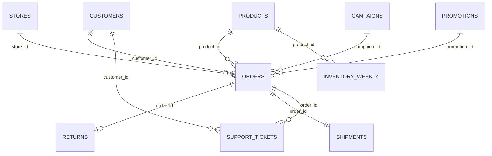

# 十表零售经营深度下钻样例

## 1. 样例目标

本数据集用于测试 Data-RAG-Agent 的多文件关联、上下文继承、策略动态调整、逐层下钻和差异化可视化能力。

- 时间范围：2025-08-01 至 2026-07-31。
- CSV 文件数：10。
- 总数据量：约 26.4 万行。
- 随机种子：`20260730`，可通过 `python generate_dataset.py` 重复生成。
- 预埋分析信号：整体增长转弱、特定区域与渠道异常、重点品类缺货、投放漏斗恶化、物流延迟、退货与客服满意度联动。
- 推荐对话轮数：8 轮。每轮必须继承上一轮结论并缩小分析范围。

## 2. 文件说明

| 文件 | 行数 | 粒度 | 主键 | 主要用途 |
| --- | ---: | --- | --- | --- |
| `01_customers.csv` | 5,000 | 客户 | `customer_id` | 客群、会员、来源、城市层级 |
| `02_products.csv` | 400 | 商品 | `product_id` | 品类、品牌、价格、成本、生命周期 |
| `03_stores.csv` | 120 | 经营单元 | `store_id` | 区域、门店类型、人员与面积 |
| `04_campaigns.csv` | 360 | 月×区域×渠道投放 | `campaign_id` | 曝光、点击、线索、归因订单、花费 |
| `05_promotions.csv` | 288 | 月×品类×活动类型 | `promotion_id` | 折扣、门槛、费用承担、活动目标 |
| `06_orders.csv` | 60,000 | 订单商品明细 | `order_id` | 数量、收入、成本、毛利、折扣 |
| `07_returns.csv` | 约 4,900 | 退货事件 | `return_id` | 退货原因、退款、责任归属 |
| `08_inventory_weekly.csv` | 127,200 | 周×区域仓×商品 | 组合键 | 库存、入库、需求、缺货、供应周期 |
| `09_shipments.csv` | 60,000 | 订单履约 | `shipment_id` | 承运商、承诺时效、实际时效、延迟 |
| `10_support_tickets.csv` | 约 5,500 | 客服工单 | `ticket_id` | 问题类型、解决时长、一次解决率、满意度 |

## 3. 关联关系



关键关联：

1. 销售事实表：`06_orders.csv`。
2. 客户、商品、门店、营销和促销通过对应 ID 与订单连接。
3. 退货、物流和客服通过 `order_id` 与订单连接。
4. 库存通过 `product_id + region + month/week_start` 与订单的商品、区域和时间对齐。
5. 营销漏斗既可通过 `campaign_id` 连接订单，也可按 `month + region + channel` 做口径复核。

## 4. 多轮对话使用规则

1. 第一轮选择全部 10 个数据资产。
2. 后续每轮保持在同一会话中，不重新描述完整背景。
3. 每轮策略必须根据新目标重新规划，不可机械复用上一轮方法。
4. 后续问题中的“上一轮对象”必须从前一轮执行结果获取；不要提前写死。
5. 每轮只使用指定图表，确保八轮图表类型完全不同。
6. 所有结论必须引用执行产物、订单记录或对应文件的 Supporting IDs。

---

## 第 1 轮：识别整体经营异常

### 递进目标

先建立全局基线，识别收入、销量和毛利在哪些月份出现结构性变化，为下一轮确定异常时间窗口。

### 可复制问题

```text
请基于全部 10 个数据文件，分析 2025-08 至 2026-07 的整体经营趋势。统一订单、退货和毛利口径，按月计算净收入、销量、毛利额、毛利率和退货率，识别趋势拐点与异常月份。当前只做时间趋势诊断，不提前做区域、渠道或原因归因；请明确指出下一轮最值得下钻的连续异常月份。
```

### 分析维度与策略

- 维度：月份。
- 指标：净收入、销量、毛利额、毛利率、退货率。
- 策略：口径统一 → 月度聚合 → 移动平均 → 环比/同比 → 拐点检测。
- 预期信号：2026 年 6—7 月经营表现转弱。

### 唯一图表

**多指标曲线图**：净收入主轴，销量与毛利率副轴，异常月份用阴影区间标记。

---

## 第 2 轮：定位异常的区域与渠道贡献

### 递进目标

沿用第 1 轮发现的异常月份，仅分析这些月份相对前一稳定期的变化来源。

### 可复制问题

```text
沿用上一轮识别出的连续异常月份，并以前一个长度相同的稳定时间窗口作为基准。请把净收入和销量的变化拆解到“区域 × 渠道”，计算每个组合对总降幅的绝对贡献和贡献率，区分是订单量下降、客单价下降还是退货增加造成。只保留贡献为负且影响最大的组合，作为下一轮下钻对象。
```

### 分析维度与策略

- 维度：异常期/基准期、区域、渠道。
- 指标：净收入差额、销量差额、客单价差额、退货损失。
- 策略：双时间窗对照 → 区域渠道分组 → 差额分解 → 负贡献排序。
- 预期信号：华东×直播是主要负贡献组合。

### 唯一图表

**堆叠柱状图**：每个区域一组柱，按渠道堆叠展示收入变化贡献；正负值使用不同颜色。

---

## 第 3 轮：下钻到品类、品牌与商品

### 递进目标

仅针对第 2 轮负贡献最大的“区域 × 渠道”组合，继续寻找具体商品结构问题。

### 可复制问题

```text
只分析上一轮负贡献最大的区域与渠道组合，并继续沿用相同的异常期和基准期。连接商品表，把销量和净收入变化下钻到“品类 × 品牌”，同时检查商品生命周期、折扣和毛利率。找出降幅最大且对该组合总降幅解释力最高的品类，再列出该品类影响最大的 10 个 SKU，作为下一轮对象。
```

### 分析维度与策略

- 维度：品类、品牌、SKU、生命周期。
- 指标：销量变化率、收入贡献、毛利率变化、平均折扣。
- 策略：商品层级钻取 → 贡献集中度 → 生命周期分层 → Top SKU 定位。
- 预期信号：智能小家电及其部分 SKU 降幅明显。

### 唯一图表

**热力图**：横轴品牌、纵轴品类，颜色表示销量变化率，格子大小或标签表示收入负贡献。

---

## 第 4 轮：检查重点品类的日内波动与事件冲击

### 递进目标

针对第 3 轮锁定的重点品类/SKU，判断下降是持续性趋势还是特定日期事件引发。

### 可复制问题

```text
针对上一轮确定的重点品类及 Top SKU，在异常月份内按日分析净收入和销量波动。将每天拆成开盘值（当日首个订单价格）、最高值、最低值、收盘值（当日最后一个订单价格），并叠加当日订单量、促销开始日以及周库存缺货状态。识别价格波动、活动切换或缺货事件对应的结构性断点，给出下一轮需要验证的主导机制。
```

### 分析维度与策略

- 维度：日期、重点 SKU、活动状态、库存状态。
- 指标：日价格 OHLC、销量、净收入、缺货标记。
- 策略：日粒度重采样 → OHLC 构造 → 波动率 → 事件窗口对齐 → 断点识别。
- 预期信号：库存紧张与活动效率下降同时出现。

### 唯一图表

**K 线图（蜡烛图）**：价格 OHLC；下方成交量显示销量，并标注促销和缺货事件。

---

## 第 5 轮：验证折扣是否真正带来增量

### 递进目标

沿用第 4 轮识别出的促销机制，检验折扣深度与销量、毛利和退货之间的非线性关系。

### 可复制问题

```text
沿用上一轮锁定的重点品类、SKU 和事件窗口，连接促销表。按促销类型与折扣区间比较销量提升、净收入、毛利率和退货率，并控制基准销量、渠道和客户分层。判断深折扣是否带来真实增量，还是仅牺牲毛利并吸引高退货订单；找出最优折扣区间，并将异常活动交给下一轮做投放漏斗分析。
```

### 分析维度与策略

- 维度：促销类型、折扣区间、渠道、客户分层。
- 指标：销量提升率、净收入增量、毛利率、退货率。
- 策略：折扣分箱 → 基准组匹配 → 响应曲线 → 边际收益 → 最优区间。
- 预期信号：过深折扣提升件数但侵蚀毛利，并伴随更高退货率。

### 唯一图表

**气泡散点图**：横轴折扣率、纵轴销量提升率、气泡大小为净收入、颜色为毛利率或退货率。

---

## 第 6 轮：下钻营销漏斗效率

### 递进目标

针对第 5 轮识别的异常促销活动，判断问题发生在曝光、点击、线索还是订单转化环节。

### 可复制问题

```text
针对上一轮识别的异常促销活动，连接 campaign_id 对应的营销投放数据，并限制在相同月份、区域、渠道和重点品类。构建“投放费用 → 曝光 → 点击 → 线索 → 归因订单 → 非退货订单”的完整漏斗，计算各层转化率、获客成本和净收入 ROI。与前一稳定期及其他区域同类活动对照，明确流失最严重的环节。
```

### 分析维度与策略

- 维度：活动、时期、区域、渠道、漏斗阶段。
- 指标：阶段转化率、CAC、有效订单率、净收入 ROI。
- 策略：跨表归因 → 漏斗重建 → 阶段损耗 → 同类对照 → 瓶颈定位。
- 预期信号：华东直播异常期投放增加，但点击、线索和订单转化恶化。

### 唯一图表

**漏斗图**：逐层显示人数/订单数及阶段转化率，异常期与基准期使用左右对照。

---

## 第 7 轮：验证库存与履约是否放大转化损失

### 递进目标

沿用第 6 轮的漏斗瓶颈，进一步检查库存、供应周期和物流履约如何传导到取消、退货及客服问题。

### 可复制问题

```text
沿用上一轮的异常区域、渠道、品类、活动和时间窗口，连接周库存、物流、退货与客服数据。量化“低库存/缺货 → 发货或到货延迟 → 物流工单 → 退货 → 收入损失”的传导链路；与库存充足且按时履约的订单做匹配对照，分别计算每条路径的订单数、转化损失和退款金额，找出影响最大的传导路径。
```

### 分析维度与策略

- 维度：库存状态、供应周期、物流状态、工单类型、退货原因。
- 指标：订单数、延迟率、工单率、退货率、退款损失。
- 策略：状态离散化 → 订单路径拼接 → 匹配对照 → 路径损失归因。
- 预期信号：智能小家电缺货和供应周期延长，进一步放大物流延迟与退货。

### 唯一图表

**桑基图**：库存状态→履约状态→工单类型→退货原因，连线宽度表示订单数或损失金额。

---

## 第 8 轮：锁定受影响客群并形成行动优先级

### 递进目标

在第 7 轮确认的主要传导路径上继续下钻到客户层，形成最终可执行策略。

### 可复制问题

```text
仅分析上一轮影响最大的库存—履约—退货路径，连接客户表与客服工单。按客户分层、会员等级、城市层级和获客来源比较收入贡献、复购代理指标、退货率、一次解决率、解决时长和满意度。识别“高价值但体验受损”的优先挽回客群，并从库存补货、投放缩减、折扣调整、承运商治理和客服 SLA 五个方向给出量化行动优先级及预期改善指标。
```

### 分析维度与策略

- 维度：客户分层、会员等级、城市层级、获客来源。
- 指标：收入贡献、订单频次、退货率、一次解决率、解决时长、满意度。
- 策略：客群分层 → 价值/风险双评分 → 体验指标标准化 → 行动优先级矩阵。
- 预期信号：部分高价值/成长型客户受物流与客服体验影响，值得优先挽回。

### 唯一图表

**雷达图**：对比优先挽回客群、普通客群和健康基准客群在价值、增长、退货、履约、客服和满意度六个维度的标准化得分。

---

## 5. 八轮图表去重清单

| 轮次 | 图表 | 不可替换为 |
| ---: | --- | --- |
| 1 | 多指标曲线图 | 柱状图 |
| 2 | 堆叠柱状图 | 曲线图 |
| 3 | 热力图 | 柱状图 |
| 4 | K 线图（蜡烛图） | 普通折线图 |
| 5 | 气泡散点图 | 普通散点图 |
| 6 | 漏斗图 | 桑基图 |
| 7 | 桑基图 | 漏斗图 |
| 8 | 雷达图 | 柱状图 |

## 6. 验收要求

每轮结果应至少包含：

1. 本轮沿用的上一轮结论与过滤条件。
2. 本轮新增的分析目标及方法匹配说明。
3. 实际使用的数据文件、连接键和数据范围。
4. 一个且仅一个指定主图表。
5. 支撑结论的明细表或 Supporting IDs。
6. 下一轮需要继承的明确对象，如异常月份、区域渠道组合、重点品类、活动或客群。

